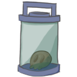

# @react-shimeji/character-skull-in-jar-shimeji-706fb6



**Skull In Jar Shimeji** — a shimeji character pack for [@react-shimeji](https://github.com/CarbonNeuron/react-shimeji).

## Install

```bash
npm install @react-shimeji/character-skull-in-jar-shimeji-706fb6
```

## Usage

```tsx
import { character } from "@react-shimeji/character-skull-in-jar-shimeji-706fb6";
```
