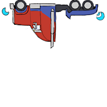

# @react-shimeji/character-vehiclemode-38c6c5



**VehicleMode** — a shimeji character pack for [@react-shimeji](https://github.com/CarbonNeuron/react-shimeji).

## Install

```bash
npm install @react-shimeji/character-vehiclemode-38c6c5
```

## Usage

```tsx
import { character } from "@react-shimeji/character-vehiclemode-38c6c5";
```
