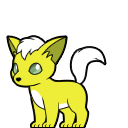

# @react-shimeji/character-vulpix-shiny1tail-993ca9



**Vulpix Shiny1tail** — a shimeji character pack for [@react-shimeji](https://github.com/CarbonNeuron/react-shimeji).

## Install

```bash
npm install @react-shimeji/character-vulpix-shiny1tail-993ca9
```

## Usage

```tsx
import { character } from "@react-shimeji/character-vulpix-shiny1tail-993ca9";
```
